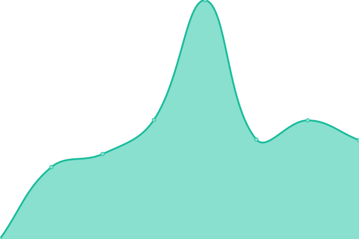
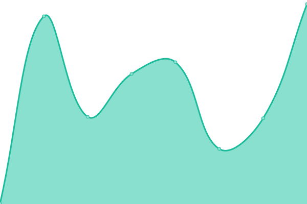
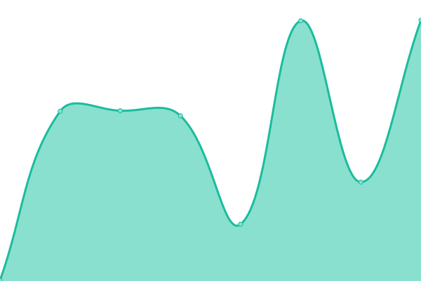
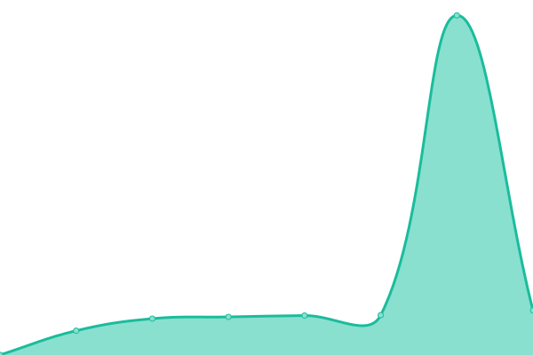

# [📈 Live Status](https://recmanj.github.io/eodh-status): <!--live status--> **🟩 All systems operational**

This repository contains the open-source uptime monitor and status page for [Jakub Recman](https://recmanj.github.io/eodh-status), powered by [Upptime](https://github.com/upptime/upptime).

With [Upptime](https://upptime.js.org), you can get your own unlimited and free uptime monitor and status page, powered entirely by a GitHub repository. We use [Issues](https://github.com/recmanj/eodh-status/issues) as incident reports, [Actions](https://github.com/recmanj/eodh-status/actions) as uptime monitors, and [Pages](https://recmanj.github.io/eodh-status) for the status page.

<!--start: status pages-->
<!-- This summary is generated by Upptime (https://github.com/upptime/upptime) -->
<!-- Do not edit this manually, your changes will be overwritten -->
<!-- prettier-ignore -->
| URL | Status | History | Response Time | Uptime |
| --- | ------ | ------- | ------------- | ------ |
|  [Earth Observation DataHub](https://eodatahub.org.uk) | 🟩 Up | [earth-observation-data-hub.yml](https://github.com/recmanj/eodh-status/commits/HEAD/history/earth-observation-data-hub.yml) | 

 894ms
     
 | 

<a href="https://recmanj.github.io/eodh-status/history/earth-observation-data-hub">100.00%</a>
    

|  [EODH Workflows](https://eodatahub.org.uk/api/docs/workflow-runner/ping) | 🟩 Up | [eodh-workflows.yml](https://github.com/recmanj/eodh-status/commits/HEAD/history/eodh-workflows.yml) | 

 303ms
     
 | 

<a href="https://recmanj.github.io/eodh-status/history/eodh-workflows">100.00%</a>
    

|  [EODH Commercial API](https://eodatahub.org.uk/api/catalogue/manage/health) | 🟩 Up | [eodh-commercial-api.yml](https://github.com/recmanj/eodh-status/commits/HEAD/history/eodh-commercial-api.yml) | 

 768ms
     
 | 

<a href="https://recmanj.github.io/eodh-status/history/eodh-commercial-api">100.00%</a>
    

|  [EODH STAC API](https://eodatahub.org.uk/api/catalogue/stac/_mgmt/ping) | 🟩 Up | [eodh-stac-api.yml](https://github.com/recmanj/eodh-status/commits/HEAD/history/eodh-stac-api.yml) | 

 382ms
     
 | 

<a href="https://recmanj.github.io/eodh-status/history/eodh-stac-api">100.00%</a>
    

|  [EODH TiTiler API](https://eodatahub.org.uk/titiler/healthz) | 🟩 Up | [eodh-ti-tiler-api.yml](https://github.com/recmanj/eodh-status/commits/HEAD/history/eodh-ti-tiler-api.yml) | 

 232ms
     
 | 

<a href="https://recmanj.github.io/eodh-status/history/eodh-ti-tiler-api">100.00%</a>
    

|  [EODH Jupyter Hub](https://eodatahub-workspaces.org.uk/healthz) | 🟩 Up | [eodh-jupyter-hub.yml](https://github.com/recmanj/eodh-status/commits/HEAD/history/eodh-jupyter-hub.yml) | 

 493ms
     
 | 

<a href="https://recmanj.github.io/eodh-status/history/eodh-jupyter-hub">100.00%</a>
    

<!--end: status pages-->

[**Visit our status website →**](https://recmanj.github.io/eodh-status)

## 📄 License

- Powered by: [Upptime](https://github.com/upptime/upptime)
- Code: [MIT](./LICENSE) © [Anand Chowdhary](https://anandchowdhary.com), supported by [Pabio](https://pabio.com)
- Data in the `./history` directory: [Open Database License](https://opendatacommons.org/licenses/odbl/1-0/)
